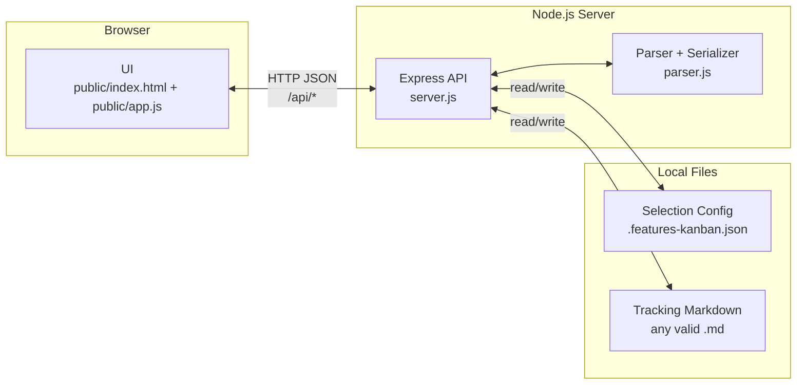

# Spec Features Kanban

Super lightweight Kanban board for managing a feature-tracking markdown file (default: `FEATURES.md`). The markdown file is the single source of truth.  The benefit for the markdown is for AI Agents to leverage as context.  This is to be used as part of the overall spec driven development approach of writing a detailed specification of what the system should do before building the code and the features helps piece each spec together.  So you define your overall specification from a feature, you put together a plan for that feature, you put together a task for the plan, and you implement the plan along with updating the task list.  The features is waht drives the plan and tasks in an interative cycle.  The features markdown file provides visibility for AI Agents to understand waht has been completed, what features remain, and what is being worked on.

## Overview

This project provides a minimal, local web UI for tracking work in a Kanban-style board while **persisting everything back into your feature-tracking markdown file**.

The main goal is to keep your feature backlog and progress in a plain, repo-local markdown file so:

- Humans can manage it quickly via drag-and-drop.
- AI agents can reliably ingest the same markdown file to understand project context, including what’s completed vs what remains.

In other words, the UI is just a convenience layer—the markdown file is the artifact that tools (and agents) can analyze.

## Launching the Features Manager

```bash
npm install
npm start
```

Open **http://localhost:3456** in your browser. If port 3456 is already in use, the server automatically tries the next available port (3457, 3458, etc.) and prints the URL in the terminal.

### Alternative: Custom Port

```bash
PORT=4000 npm start
```

## Managing the Tracking File

The Kanban UI provides a visual way to manage the feature tracking document without editing markdown directly.

### Kanban Columns

- **🔨 Work In Progress** – Shows all features with status `🔨 WorkInProgress` (across all categories)
- **Category columns** – One column per category section (shows features in that category that are *not* WIP or Complete)
- **✅ Completed** – Shows all features with status `✅ Complete` (across all categories)

### Workflows

| Action | How |
|--------|-----|
| **Mark complete** | Drag a card to the "✅ Completed" column |
| **Start work** | Drag to "🔨 Work In Progress" |
| **Reassign category** | Drag to another category column |
| **Create feature** | Click "+ Create New Feature" |
| **Edit feature** | Click "Edit" on any card |
| **Delete feature** | Click "Delete" on any card |
| **Add category** | Click "+ Add Category" |
| **Delete category** | Click "Delete" in a category header (only deletes if truly empty) |

### Create New Feature

1. Click **+ Create New Feature**
2. Select **Category** first (or type a new category name)
3. **Feature ID** auto-fills (e.g. UX-022 for User Experience)
4. Fill Title, Description, Status, Assignee, and optional fields
5. **Assignee** suggests existing assignees from FEATURES.md; you can type a new one
6. Click **Save**

### Edit Feature

Click **Edit** on a card to update Title, Description, Phase, Status, Assignee, Plan Document, Notes, or Category.

## File Location

By default the server reads and writes `FEATURES.md` in the project root.

You can switch which file is used via the UI (the selection is persisted in `.features-kanban.json`).

### First Run (Template Creation)

On first run, if no valid tracking file is selected/found, the server will create a template file so you can start immediately.

### File Format Validation

When selecting a file, the app validates it looks like a feature-tracking document (it must include `## Feature Categories`, at least one feature table with a `| Feature ID |` header, and `## How to Use This File`).

### Environment Override

You can also force a specific file path:

```bash
FEATURES_PATH=path/to/your-tracking-file.md npm start
```

When `FEATURES_PATH` is set, the UI will run in “fixed file” mode (you can’t switch/create files from the browser).

## API

- `GET /api/features` – Parse and return features as JSON
- `PUT /api/features` – Update the active tracking file from JSON body
- `GET /api/config` – Return the current tracking file selection
- `PUT /api/config` – Set the tracking file selection
- `GET /api/features-files` – List candidate tracking files under the project root (based on format validation)
- `POST /api/browse-features` – Browse for a tracking file (macOS only)
- `POST /api/create-features-file` – Create a new template tracking file (project-relative path) and switch to it

## Architecture & Design

### High-level Architecture

This is a small, local web app with a thin backend whose only job is to:

- Serve the static UI
- Read/parse the selected tracking markdown file
- Write updates back to that same file

The tracking markdown file is the **single source of truth**. The UI is a convenience layer for humans; the same markdown file is intended to be easy for AI agents/tools to ingest.

### Components

- **Browser UI** (`public/`)
	- Renders columns/cards in-memory from the JSON returned by the API
	- Persists changes by sending the full updated structure back to the server
- **Express server** (`server.js`)
	- Serves `public/` and exposes JSON APIs
	- Maintains the currently active tracking file path
- **Parser + serializer** (`parser.js`)
	- Parses markdown into `{ categories: [...] }`
	- Serializes categories back into markdown tables
	- Preserves non-table content via preamble/postamble extraction
- **Config file** (`.features-kanban.json`)
	- Persists the active tracking file path between runs

### Solution Design Notes

- **Source of truth is a file**: the app never uses a database; everything is derived from and persisted into the selected markdown file.
- **Column model**:
	- The UI shows two *global* columns derived from status: `🔨 WorkInProgress` and `✅ Complete`.
	- Category columns show items in that category **excluding** WIP and Complete.
	- This can make a category column *look empty* even when the category still contains WIP/Completed items.
- **File selection**:
	- Selection is persisted in `.features-kanban.json`.
	- `FEATURES_PATH` can override selection for a fixed-file mode.
- **File format validation**: when selecting a file, the server validates it matches the expected tracker shape before switching.

### Diagram



## Features

- **Selectable tracking file**: Pick which markdown file is the source of truth (persisted in `.features-kanban.json`)
- **Create tracking file**: Create a new template file with a custom name
- **Native browse (macOS)**: Choose a file using the OS file picker
- **Template on first run**: If nothing is selected/found, a starter template is created
- **Format validation**: Prevent selecting files that don’t match the expected tracking format
- **Kanban columns**: WIP and Completed are global; category columns show non-WIP/non-Complete items
- **Drag & drop**: Move cards to update status or category; changes persist to the tracking file
- **Create / edit / delete features**: Full CRUD from the UI
- **Add / delete categories**: Add new categories; delete only when truly empty
- **Deletion guardrails**: If a category looks empty but still has hidden WIP/Completed items, deletion shows an alert explaining why
- **Assignee suggestions**: Prepopulated from existing assignees; supports new assignees
- **Auto-save**: Changes are written directly to the tracking file
