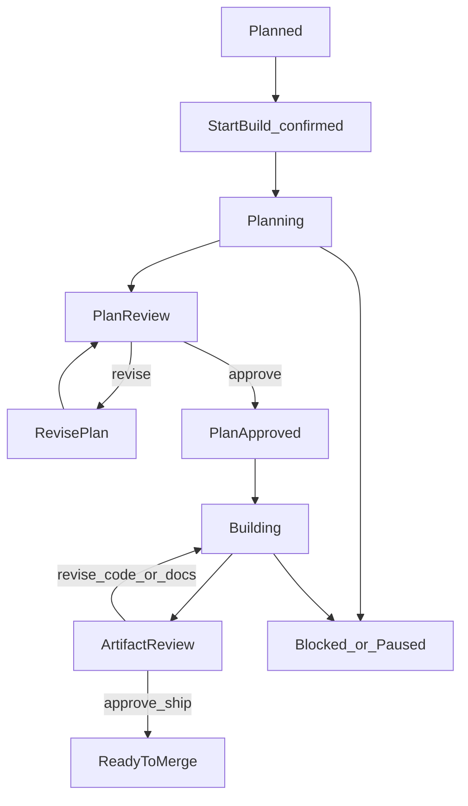
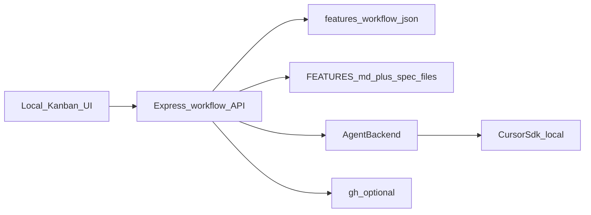

# AGENT-001: Local Cursor Spec Workflow Plan

**Status:** Planned
**Feature ID:** AGENT-001
**Tasks:** `specifications/tasks/AGENT-001-IMPLEMENTATION-TASKS.md`
**Human approval required before implementation:** Yes

## Goal

Turn the local Kanban into a control surface for a gated spec workflow. From the
board, a human confirms **Start planning**. The app fires a **Cursor agent** that
writes plan and task markdown. The human reviews those artifacts in the UI, asks
the same agent to revise until they approve, then the agent implements, writes a
completion summary and security review, and can open a merge request.

v1 runs entirely on the local machine: `npm start`, local `FEATURES.md`, Cursor
SDK against the target repo `cwd`. Hosting, phone access, and always-on remote
agents are AGENT-002.

## Current state

The app is a thin local sidecar:

- [server.js](../../server.js) serves `public/` and reads/writes one tracking file
- [parser.js](../../parser.js) parses/serializes markdown tables
- [public/app.js](../../public/app.js) maps drop-on-WIP to `WorkInProgress` with no confirm
- Feature rows already have Phase, Status, Assignee, and Plan Document
- Status legend already includes Planned, WIP, Testing, ReadyToMerge, Complete, Blocked, Paused
- There is no agent runtime, no workflow state, and no feature workspace beyond the edit modal

## Dependencies

- Prerequisite features: CORE-001 through CORE-005 (board + persist + file selection)
- Parallel-safe features: CORE-006 (this specifications folder)
- Blockers: none for a local Cursor SDK spike; needs `CURSOR_API_KEY` at runtime

## Context to load

- Required: this plan, `specifications/tasks/AGENT-001-IMPLEMENTATION-TASKS.md`, [README.md](../../README.md), [server.js](../../server.js), [parser.js](../../parser.js), [public/app.js](../../public/app.js), [public/index.html](../../public/index.html)
- Conditional: Cursor SDK docs (`@cursor/sdk`) when wiring the adapter
- Do not load by default: AGENT-002 hosted/phone design notes beyond the out-of-scope section

## Scope

### In scope (v1)

- New workflow statuses (or chips) for Planning and PlanReview; reuse WIP, Testing, ReadyToMerge, Blocked
- Feature workspace (drawer or route) with Plan/Tasks, Implementation, Review, and Ship
- Explicit confirm before any agent starts; drag-and-drop must not fire an agent
- Sidecar workflow state (for example `.features-workflow.json`): `agentId`, `runId`, backend, stage, approvals, last error
- `FEATURES.md` stays the feature contract: status, plan path, notes, MR URL
- Cursor SDK adapter: `Agent.create` + `send` + `resume` with `local: { cwd }` pointed at the git root of the selected tracking file
- One durable agent per feature; revise uses `send` on the same agent
- One active run per target repo; queue or refuse the second
- Staged prompts with hard stops: plan/tasks only, then implement only after approval, then review artifacts, then MR only from Ship
- Optional local MR creation via `gh` after ship approval
- Pluggable `AgentBackend` interface so a later cloud/hosted adapter can replace local without rewriting the UI

### Out of scope (v1)

- Hosted HTTPS service, GitHub OAuth, or opening the board from a phone as the primary runtime
- Cursor cloud agents as the default (optional later if the local adapter stays small)
- Slack/Discord/push notifications
- Auto-merge
- Multi-tenant SaaS
- Parallel agents on the same repo
- Replacing the IDE for hard debugging
- Putting run transcripts or job queues into `FEATURES.md`

## Recommended pipeline

Statuses:

- `📝 Planning` — Cursor agent writing plan + tasks
- `👀 PlanReview` — waiting on the human in the workspace
- `🔨 WorkInProgress` — implement phase
- `🧪 Testing` — completion summary + security review waiting on the human
- `🟢 ReadyToMerge` — MR exists
- `🚫 Blocked` — agent or checks failed

`Plan Document` becomes a real path once planning finishes, for example
`specifications/plans/UX-002-empty-column-PLAN.md`.

## Feature workspace

Clicking a card opens a workspace, not only the current edit modal. Four tabs:

1. **Plan / Tasks** — render the markdown artifacts; Approve or send a revision prompt
2. **Implementation** — run status, last assistant summary, Cancel
3. **Review** — completion summary + security review
4. **Ship** — create MR, copy link

Board cards may show a pipeline chip (`planning` / `awaiting approval` / `coding` / `review`)
so the board does not grow eight columns.

## Architecture (v1)

Keep Express as the control plane. Add a `workflow/` module rather than stuffing
everything into [server.js](../../server.js).

**AgentBackend** (smallest useful interface):

- `start({ cwd, prompt, model, featureId })` → `{ agentId, runId }`
- `send({ agentId, prompt })` → `{ runId }`
- `stream(runId)` or `status(runId)`
- `wait(runId)` / `cancel(runId)`
- `resume(agentId)` after server restart

First adapter: Cursor SDK local. Model required for local. Read `CURSOR_API_KEY`
from the environment; do not put it in `FEATURES.md` or the browser.

Target repo: git root of the selected tracking file. Require `specifications/`
(or tell the user to inflate it). The kanban repo is the target only when the
tracking file lives here.

## Human gates

| Gate | Human action | Agent may not |
|------|--------------|---------------|
| Start | Confirm Start planning | Start on drag or page load |
| Plan | Approve plan + tasks | Write product code |
| Ship | Approve completion + security review | Open an MR |
| Merge | Happens on GitHub/GitLab | Merge the branch |

The app checks the task-template approval boxes when the human clicks Approve.
If security review has blockers, status is `🚫 Blocked`, not `🟢 ReadyToMerge`.

## Later (AGENT-002, not this feature)

Hosted control plane, git-connected repos, Cursor cloud as default, phone UI,
and Slack/Discord/push when a gate is waiting. Do not build that in v1. Keep the
`AgentBackend` interface so cloud/hosted is a new adapter, not a rewrite.

## Implementation approach

1. Add Planning / PlanReview statuses and a feature workspace shell that reads
   and writes plan/task markdown. No agent yet.
2. Add `.features-workflow.json` plus start/cancel/status/approve APIs. One
   active run per repo.
3. Wire the Cursor SDK local adapter for planning and revise-until-approve.
4. After plan approval, send the implement prompt; then write completion +
   security review artifacts.
5. After ship approval, optionally create an MR with `gh` and write the URL
   onto the feature row.

## Verification plan

- Automated checks: none required beyond existing start-up; add a small unit
  test for workflow state transitions if a test runner is introduced
- Manual checks: start the local board, confirm Start planning on a sample
  feature, review generated plan/tasks in the workspace, send one revision,
  approve, confirm implement does not start before approval, cancel a run
- Skipped checks: phone/hosted reachability (AGENT-002); cloud-agent PR
  auto-create

## Security review scope

Standalone security review is required. The feature launches a coding agent
with repo write access from a local web UI. Review must cover: `CURSOR_API_KEY`
never sent to the browser, prompt injection via feature title/description,
no merge/deploy tools, confirm-before-start, and CSRF/local-bind assumptions
(`localhost` only in v1).

## Acceptance criteria

- [ ] Plan and tasks approved by a human before implementation.
- [ ] Dependencies checked.
- [ ] Implementation matches approved v1 scope (local app + Cursor agents).
- [ ] Drag-and-drop does not start an agent.
- [ ] Plan/task revision loop uses one resumed Cursor agent per feature.
- [ ] Implement starts only after explicit plan approval.
- [ ] Completion summary and security review are reviewable in the UI before MR.
- [ ] Verification evidence recorded.
- [ ] Security review completed or skip rationale documented.
- [ ] Completion summary created for PR handoff.
