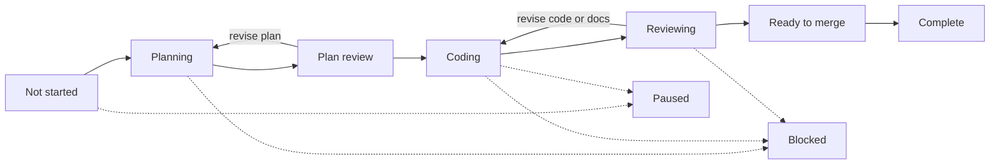

# CORE-013: Spec workflow process graph Plan

**Status:** Planned  
**Feature ID:** CORE-013  
**Tasks:** `specifications/tasks/CORE-013-IMPLEMENTATION-TASKS.md`  
**Human approval required before implementation:** Yes  

**Intent brief:** This plan implements the control-room Process view described in the original planner input (stage mapping, visual contract, and acceptance themes below). Kanban remains the default view.

## Goal

A human running several features opens **Process** in the header and immediately sees the spec-driven lifecycle as a left-to-right pipeline graph: every tracked feature on exactly one stage, stage occupancy counts, obvious **live agent** and **waiting on human** states, and click-through into the existing feature workspace—without opening each card to learn what is running fleet-wide.

## Current state

- **Kanban** (`public/app.js` `renderColumns()`) groups cards by WIP / category / Completed, not pipeline stages.
- **Pipeline chips** use `pipelineStage()` in `workflow/artifacts.js`, which maps Planning, PlanReview, WIP, Testing, ReadyToMerge, and Complete only; it does not return stages for Planned, Blocked, or Paused.
- **CORE-011** live activity and polling live inside one feature workspace; there is no cross-feature fleet view.
- **AGENT-001** enforces **one active run per target repo** (`activeRun` in `workflow/state.js`, `findActiveRun` / `setActiveRun` in `workflow/runner.js`). A second Start is refused repo-wide, which blocks the “several agents at once” outcome until relaxed.
- **CORE-012** search (`uiState.searchQuery`, `applySearch()`) filters board cards; Process occupants must honor the same filter for counts and visibility.

## Dependencies

- **Prerequisite features:** AGENT-001 (workflow sidecar, workspace, gated starts), CORE-011 (transcript / `runStatus` / poll behavior), CORE-001 (feature load).
- **Parallel-safe features:** CORE-007 (workspace preview), CORE-012 (search semantics).
- **Blockers:** None for a static graph; parallel live runs depend on runner/state changes in slice 3.

## Context to load

- **Required:** this plan, task list, `specifications/FEATURES.md`, `workflow/artifacts.js` (`pipelineStage`), `public/index.html`, `public/app.js`, `public/style.css`, AGENT-001 plan (pipeline + one-run constraint), CORE-011 plan (live transcript).
- **Conditional:** `workflow/runner.js`, `workflow/state.js`, `server.js` if slice 3 (parallel runs) or a summary API is implemented.
- **Do not load by default:** CORE-010 stubs, AGENT-002 hosted design, full historical completion docs.

## Scope

### In scope

- Header **Board / Process** toggle; default **Board**; Process replaces `#columns` main area when selected (not a permanent stack above Kanban).
- Custom pipeline graph UI (not a raw mermaid render of this doc): named stage nodes, happy-path edges, revise loops (plan review → planning, reviewing → coding), Blocked and Paused as visible side states.
- Place every feature from the current tracking file on **one** graph stage using the mapping table below (extend shared stage resolution in `workflow/artifacts.js`, not a forked browser-only vocabulary).
- Per-stage occupancy counts; search hides occupants the same way CORE-012 hides cards.
- Live treatment on stages/occupants when `runStatus` is `starting` or `running`; waiting treatment on human gates (Plan review, Reviewing when agent idle).
- Occupant pills: Feature ID, truncated title, run badge; optional truncated last activity line from CORE-011 sidecar fields.
- Click occupant → open existing feature workspace (CORE-007 / AGENT-001 / CORE-011); no second workspace; **no agent start** from merely opening Process.
- Poll Process data while **any** displayed feature has a live run; otherwise manual Refresh is enough.
- **Parallel agents (preferred):** allow N concurrent runs on the same repo (one run per feature max); replace singular `activeRun` with a per-repo list; document in verification. **Fallback:** if cut at approval, ship graph with honest single-run UX (live run + queued/waiting occupants) and record follow-on **AGENT-003** (or equivalent) in tasks/notes—do not imply multiple agents are running.

### Out of scope

- Removing or replacing Kanban.
- New `FEATURES.md` statuses unless the mapping table is proven insufficient.
- Hosted / phone / notifications (AGENT-002).
- Starting agents from the graph without existing confirm gates; auto-merge / deploy.
- Storing graph layout, transcripts, or job queues in `FEATURES.md`.
- Full raw SDK replay or faster-than-current token streaming.
- Analytics / historical burn-down (stage totals from current snapshot are fine).

## Stage mapping (single source for graph placement)

| Graph stage | FEATURES.md status | Workflow sidecar signal (`.features-workflow.json`) | Meaning |
|-------------|--------------------|-----------------------------------------------------|---------|
| Not started | `📋 Planned` | no run, or never started | Backlog |
| Planning | `📝 Planning` | `kind` planning, `runStatus` starting/running | Agent writing plan + tasks |
| Plan review | `👀 PlanReview` | run idle/complete; waiting Approve / revise | Human gate |
| Coding | `🔨 WorkInProgress` | `kind` implement (or similar), starting/running | Agent writing product code |
| Reviewing | `🧪 Testing` | review artifacts present or being written | Completion + security review |
| Ready to merge | `🟢 ReadyToMerge` | `mrUrl` / ship approved | Ready to commit / PR exists |
| Complete | `✅ Complete` | n/a | Merged / done |
| Blocked | `🚫 Blocked` | `lastError` or failed run | Failed or blocked |
| Paused | `⏸️ Paused` | cancelled or human paused | Stopped on purpose |

Graph labels: use **Ready to merge** for the `🟢 ReadyToMerge` stage (same status, human-readable node title).

Sidecar may override or refine placement when status and run state disagree (e.g. Planning status with idle run → still Plan review if waiting on human); implementers should follow AGENT-001 workspace rules, then map to the table.

## Pipeline topology (implementation reference)

Stage nodes look like process steps. Occupied nodes show a count. Complete features remain on the graph by default (no required “hide completed” for v1; optional filter only if trivial).

## Implementation approach

1. **Stage resolution + static Process pane**  
   Extend `pipelineStage()` (or add `graphStage(feature, sidecar)` sibling used by server and client) to cover Planned, Blocked, Paused, and align naming with the table. Add view toggle and Process DOM that lays out stage nodes and places feature pills from `GET /api/features` plus per-feature workflow status already used by the workspace (batch or parallel fetch). Honor search when rendering occupants and counts.

2. **Live, waiting, and navigation**  
   Apply live/waiting CSS and accessible labels (`aria-live` / text, not color-only). Poll on the same interval as workspace when any shown feature is `starting`/`running`. Click pill opens workspace for that `featureId`. Reuse truncated transcript fields for optional one-liner on occupant.

3. **Parallel runs or honest queue**  
   **Preferred:** refactor `workflow/state.js` / `workflow/runner.js` to track multiple active runs per repo keyed by feature; refuse second run on the **same** feature only. Update start/refuse messaging in workspace if needed.  
   **Optional:** add `GET /api/workflow/process-summary` (or extend existing bulk status) to avoid N+1 polling—local only, no new auth.  
   **If parallel is deferred at approval:** show at most one live run on the graph; other features with pending starts show “waiting for agent slot” (or equivalent) on their stage; create follow-on feature ID in completion notes.

## Verification plan

- **Automated checks:** none required today.
- **Manual checks:**
  - Board / Process toggle; Board unchanged as default.
  - Every feature appears on one stage matching the mapping table (spot-check Planned, Complete, Blocked, Paused, and agent stages).
  - Search reduces occupants and stage counts consistently with Kanban.
  - Start planning on one feature: live state visible on Process without opening workspace; click-through opens correct workspace.
  - With parallel slice shipped: two features can run planning/implement concurrently and both show live on the graph; second start on **same** feature still refused.
  - With parallel deferred: graph honestly shows single-run limit.
  - Opening Process alone does not start an agent.
- **Skipped checks:** phone layout polish (AGENT-002); hosted deployment.

## Security review scope

Standalone review recommended but lightweight: Process may show truncated transcript snippets and errors from the sidecar—same rules as CORE-011 (no API keys, truncate tool payloads). No new secrets in the browser; summary endpoint read-only. Opening Process must not trigger agent execution.

## Planner recommendations (confirm at human approval)

| Question | Recommendation |
|----------|----------------|
| Toggle vs side panel | **Toggle** in header/actions; Process replaces main column area. |
| Parallel agents in CORE-013 | **Yes, slice 3** unless human cuts scope → AGENT-003 follow-on. |
| Complete on graph | **Show by default** on Complete node; optional hide filter only if cheap. |
| Ready label | **Ready to merge** node title for `🟢 ReadyToMerge`. |

## Acceptance criteria

- [ ] Plan and tasks approved by a human before implementation.
- [ ] Dependencies checked (AGENT-001 sidecar, CORE-011 live fields, CORE-012 search).
- [ ] Board / Process toggle exists; Board default unchanged.
- [ ] Process shows named pipeline stages with revise loops and Blocked/Paused visible.
- [ ] Every feature on one correct stage; search filters occupants and counts.
- [ ] Live planning/implement runs obvious on the graph; human-gate waiting distinguishable.
- [ ] Click feature on graph → existing workspace; no agent start from view open alone.
- [ ] Multiple concurrent agents supported **or** follow-on feature documented and UI honest.
- [ ] Verification evidence recorded; security review completed or skip rationale documented.
- [ ] Completion summary created for PR handoff.
