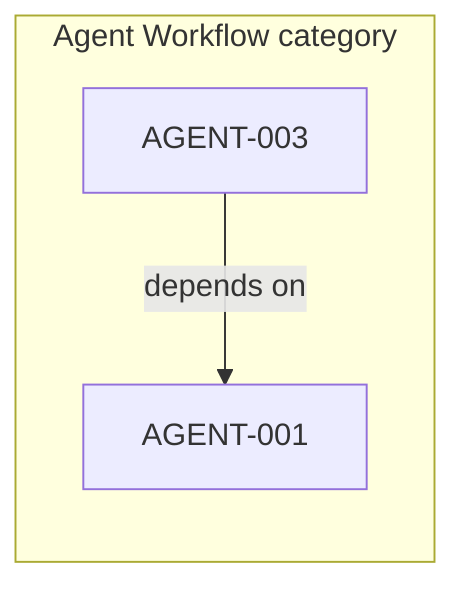

# CORE-017: Feature relationship knowledge graph Plan

**Status:** Planned  
**Feature ID:** CORE-017  
**Tasks:** `specifications/tasks/CORE-017-IMPLEMENTATION-TASKS.md`  
**Human approval required before implementation:** Yes

**Intent brief:** Add a **Graph** view where every tracked feature is a node and labeled edges show how features relate (depends on, blocked by, same category). A human sees the web of work—not only Kanban columns or the Process lifecycle pipeline. Click a node opens the existing workspace; this view never starts agents.

## Goal

Open **Graph** in the header (third toggle beside Board and Process) and see all features from the current tracking file as a knowledge graph. Selecting a node highlights it and its neighbors; each edge shows its type and direction (for example AGENT-003 **depends on** AGENT-001). Search hides nodes the same way it hides board cards. Click a node to open the same workspace as a card or Process occupant.

## Current state

- **Board** groups by WIP / category / Completed (`CORE-012` counts, `CORE-015` chips).
- **Process** (`CORE-013`) places each feature on one lifecycle stage via `setMainView('process')`, `#processView`, and `renderProcess()`. It does not show feature-to-feature edges.
- **Header toggle** is Board / Process only (`uiState.mainView` is `'board' | 'process'`). `#columns[hidden]` and `.process-view[hidden]` use `display: none !important` in `public/style.css`.
- Relationships today live in prose: registry **Notes** (for example “Depends on AGENT-001”), plan **Dependencies** sections, and shared category tables. There is no structured `dependsOn` column on the feature row.
- **Search** (`CORE-012`: `uiState.searchQuery`, `applySearch()`, `featureSearchText()`) filters board and Process; Graph must reuse the same filter.

## Dependencies

- **Prerequisite:** CORE-001 (load features), CORE-013 (main-view toggle pattern and hiding `#columns`).
- **Parallel-safe:** CORE-007 (workspace open), CORE-011 / CORE-013 (run badge fields on feature payload if already present), CORE-012 (search).
- **Not this feature:** AGENT-002 hosting, AGENT-003/004/005 vendor adapters, replacing Process, repo-wide code graphs.

## Context to load

- **Required:** this plan, task list, `specifications/FEATURES.md`, `public/index.html`, `public/app.js` (`setMainView`, `renderMainView`, `renderProcess`, `openWorkspace`, search helpers), `public/style.css` (view hidden rules, Process styles as reference), `GET /api/features` enrichment in `server.js` if relations are computed server-side.
- **Conditional:** new `workflow/feature-relations.js` (or extension in `workflow/artifacts.js`) for parsing; plan markdown under `specifications/plans/` for dependency section patterns.
- **Do not load by default:** graphify / Neo4j tooling, AGENT-002 hosted design, unrelated agent adapter code.

## Relationship types (v1)

| Edge type | How it is known | Example |
|-----------|-----------------|---------|
| **depends on** | Registry Notes or plan **Dependencies** text matching `Depends on <ID>` or bullet lists of feature IDs (`CORE-001`, `AGENT-003`, …) | AGENT-003 → AGENT-001 |
| **blocked by** | Status `🚫 Blocked` and Notes (or plan) naming another tracked feature ID | — |
| **same category** | Both features appear in the same category table in FEATURES.md | CORE-* in Core |
| **plan link** (optional) | Notes or Plan Document path clearly references another feature’s plan/tasks path | only if cheap to parse |

Rules:

- Every feature in the loaded file is exactly one node, even with zero parsed edges.
- Only create an edge when the target ID exists in the current feature set and the link is parsed honestly from Notes/plan/category—not from git history or import graphs.
- Do not infer coupling from source code files in v1.

Document the extraction rules in code comments and in a short “Relation sources” subsection of the completion summary so a later slice can add an explicit Depends column without rewriting the graph.

## Scope

### In scope

- Header **Board / Process / Graph** toggle; default **Board**. Graph uses the same main-area swap as Process (hide `#columns`, show graph pane; never stack graph above visible columns).
- Custom graph UI in this app: feature nodes + **labeled directed edges** (DOM/CSS/SVG). Not a raw mermaid dump of this doc; not an external graphify pipeline.
- **Search-aware:** hidden nodes drop out of the graph; edges touching hidden nodes are hidden.
- **Node content:** Feature ID, truncated title, category cue, status/stage cue; reuse live/waiting styling from Process when `runStatus` / `waitingOnHuman` are on the payload.
- **Interaction:** click node → `openWorkspace(featureId)`; optional select/hover to highlight neighbors and show edge labels in a legend or on-edge text.
- **Read-mostly:** v1 does not edit FEATURES.md by drawing edges.

### Out of scope

- Full repository or code knowledge graph (GraphRAG, Neo4j, graphify HTML export as the primary UI).
- Editing relationships by drag-connect in the UI.
- Historical timeline or burn-down on the graph.
- Auto-creating features from inferred code dependencies.
- Replacing Board or Process.
- Voice I/O, spoken briefings, or a Jarvis virtual person (CORE-018).

## Graph topology (conceptual)

Process = **when** in the lifecycle. Graph = **who relates to whom**. Both views stay.

Same-category edges may be shown as lighter undirected links or as visual grouping (category badge on node); avoid a complete mesh if it harms readability—prefer grouping with at most optional pairwise same-category edges when the category has few members.

## Implementation approach

1. **Relation model and extraction**  
   Add a small shared helper (for example `buildFeatureGraph(features, { planContentsById? })`) that returns `{ nodes, edges }` with stable edge ids and types. Parse feature IDs with a conservative regex (`\b(CORE|AGENT)-\d{3}\b`). Scan each feature’s `notes`, and when available the linked plan file’s Dependencies section. Emit **depends on** and **blocked by** only when the target id is in the feature set. Emit **same category** from `categoryTitle`. Optionally read plan paths from Notes/Plan Document for **plan link**. Record parsing limits in module header comment.

2. **API or client assembly**  
   **Preferred:** enrich `GET /api/features` (or a sibling read-only `GET /api/features/graph`) with `graphEdges` per feature or a top-level `graph` object so browser and future tools share one implementation. **Acceptable for v1:** client builds graph from notes + category only if plan scanning is deferred—then document missing plan-only deps as a known gap until server reads plans.

3. **View toggle and pane**  
   Extend `uiState.mainView` to `'board' | 'process' | 'graph'`. Add `#graphView` / `#featureGraph` in `index.html`, Graph button in the header group, update `syncViewToggleButtons()` and `renderMainView()` to hide both `#processView` and `#graphView` when not active. Keep `#columns[hidden]` behavior identical to Process.

4. **Render and layout**  
   Implement `renderFeatureGraph()` mirroring Process entry points (called from `renderMainView` and after `load()`). Layout: dark full-canvas **force-directed network** (circular glowing nodes, thin edges, degree-sized hubs)—not category columns of cards. Hover highlights neighbors; edge type labels appear on focus. Nodes are keyboard-focusable and open the workspace on activate. Zoom and pan are CORE-019. Apply `applySearch(getAllFeatures())` before building nodes.

5. **Live state and polling**  
   If any **visible** graph node has `runStatus` starting/running, reuse Process polling interval while Graph is active; otherwise Refresh is enough. Opening Graph alone must not call runner start APIs.

## Verification plan

- **Automated checks:** none required today.
- **Manual checks:**
  - Board / Process / Graph toggle; Board remains default; Kanban unchanged on Board.
  - Every feature in FEATURES.md appears as a node.
  - AGENT-002 (if present) and AGENT-003/004/005 show **depends on** → AGENT-001 when Notes/plans say so.
  - Search reduces visible nodes; edges to hidden nodes disappear.
  - Click node opens correct workspace; opening Graph does not start an agent.
  - Process view still works; `#columns` fully hidden on Graph and Process.
- **Skipped checks:** mobile polish beyond horizontal scroll; external graph export.

## Security review scope

Lightweight standalone review: graph uses the same feature fields already returned to the browser (notes, titles, truncated activity). No new secrets endpoints. Plan file reads are local repo paths only—do not expose paths outside the project root. Graph mount must not trigger agent execution.

## Acceptance criteria

- [ ] Plan and tasks approved by a human before implementation.
- [ ] Dependencies checked (CORE-001, CORE-013 toggle/hide pattern, CORE-012 search).
- [ ] Board / Process / Graph toggle exists; Board default unchanged.
- [ ] Every tracked feature has a node; parsed dependencies appear as labeled edges.
- [ ] Search filters nodes (and dependent edges) consistently with Kanban.
- [ ] Click node → existing workspace; no agent start from opening Graph alone.
- [ ] Relation extraction documented for future structured Depends field.
- [ ] Verification evidence recorded; security review completed or skip rationale documented.
- [ ] Completion summary created for PR handoff.
